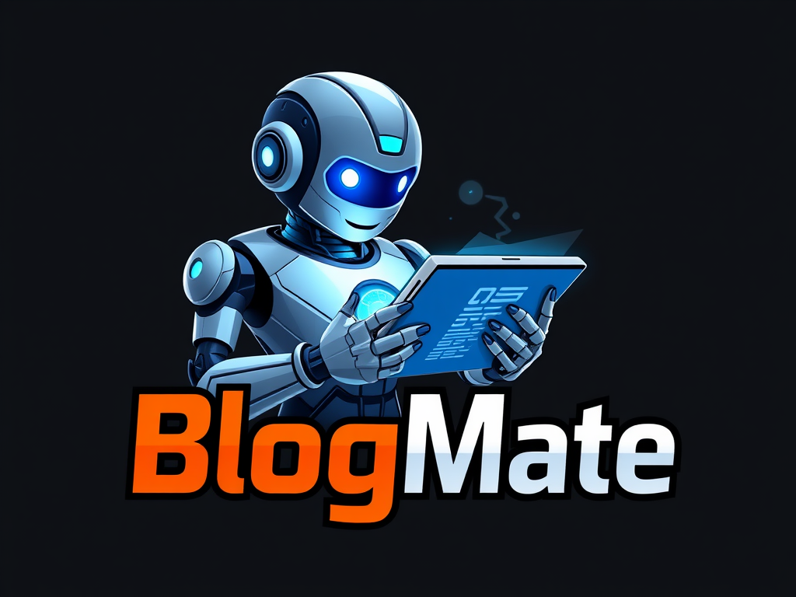

# BlogMate

<!-- Project Badges -->
<p align="center">
  <a href="https://blogmate-1amy.onrender.com/docs/index.html" target="_blank">
    
  </a>
  
  
  
  <a href="https://github.com/yesetoda/BlogMate/issues" target="_blank">
    
  </a>
  <a href="https://github.com/yesetoda/BlogMate/commits/master" target="_blank">
    
  </a>
  <a href="https://github.com/yesetoda/BlogMate/stargazers" target="_blank">
    
  </a>
  <a href="https://github.com/yesetoda/BlogMate/network/members" target="_blank">
    
  </a>
  <br><br>
</p>
  

 **BlogMate** is a powerful, feature-rich blogging API built in Go with the Gin framework and backed by MongoDB. It supports secure user management, complete CRUD operations for blog posts, interactive comments and replies, and AI-powered content recommendations via Gemini AI. Designed by the [Yesetoda](https://github.com/yesetoda) team, BlogMate is engineered for scalability and seamless integration into your development and deployment pipelines.


## Table of Contents

- [Features](#features)
- [Architecture & Tech Stack](#architecture--tech-stack)
- [Installation & Setup](#installation--setup)
- [Configuration](#configuration)
- [Running the Application](#running-the-application)
- [API Documentation](#api-documentation)
- [AI Model & Validation](#ai-model--validation)
- [Contributing](#contributing)
- [License](#license)
- [Contact](#contact)


## Features

- **User Management:**  
  Secure registration, login, account verification, token refresh, and role-based authorization (JWT).

- **Blog Management:**  
  Full CRUD support for blog posts along with pagination and filtering.

- **Interactive Comments & Replies:**  
  Easily post comments and threaded replies with like, dislike, and view functionalities.

- **AI-Powered Recommendations:**  
  Integrates Gemini AI to boost your content:
  - **Blog Recommendations:**  
    ```go
    RecommendBlogs(Data) ([]domain.BlogRecommendation, error)
    ```
  - **Title Suggestions:**  
    ```go
    RecommendTitle(content string, tags []string) (string, error)
    ```
  - **Content Generation:**  
    ```go
    RecommendContent(title string, tags []string) (string, error)
    ```
  - **Tag Recommendations:**  
    ```go
    RecommendTags(title string, content string) ([]string, error)
    ```
  - **Content Summarization:**  
    ```go
    Summarize(Data) (string, error)
    ```
  - **Validation:**  
    ```go
    Validate(Data) error
    ```
  - **Chat Interface:**  
    ```go
    Chat(prompt string) (string, error)
    ```

- **Email Support:**  
  Uses Google App credentials to send verification emails and notifications.

- **Validation & Rule Enforcement:**  
  Automatically ensures your blog content complies with predefined standards.

- **Swagger Documentation:**  
  Comprehensive API docs generated via Swaggo are available for interactive testing.


## Architecture & Tech Stack

- **Language:** [Go (Golang)](https://golang.org/)
- **Framework:** [Gin](https://github.com/gin-gonic/gin)
- **Database:** [MongoDB](https://www.mongodb.com/)
- **API Documentation:** [Swagger (Swaggo)](https://github.com/swaggo/swag)
- **AI Integration:** Gemini AI for smart content recommendations
- **Email Integration:** Google App credentials
- **Configuration:** YAML-based configuration (with environment variable overrides)


## Installation & Setup

### Prerequisites

- [Go](https://golang.org/dl/) (version 1.24+)
- [MongoDB](https://www.mongodb.com/)
- Gemini AI account & API key
- Google App credentials for email support

### Clone the Repository

```bash
git clone https://github.com/yesetoda/BlogMate.git
cd BlogMate
```

### Install Dependencies

Enable [Go Modules](https://github.com/golang/go/wiki/Modules) and download dependencies:

```bash
go mod download
```

### Build the Application

Since the entry point is in `delivery/main.go`:

```bash
cd delivery
go build -o blogmate
```

---

## Configuration

BlogMate uses a YAML configuration file. Although `config.yaml` is **gitignored**, you can provide your configuration via environment variables on production platforms such as Render.

**Local Development:**
Create a `config.yaml` in the project root with the following structure:

```yaml
database:
  username: <your-database-username>
  password: <your-database-password>
  uri: <your-database-uri>
email:
  key: <google-app-key>
port: <port-number>
jwt: <jwt-key>
gemini:
  api_key: <your-gemini-key>
  model: <gemini-model-name>
```

**Production Deployment:**
Use environment variables on Render (for example):

- `DATABASE_USERNAME`
- `DATABASE_PASSWORD`
- `DATABASE_URI`
- `EMAIL_KEY`
- `PORT`
- `JWT`
- `GEMINI_API_KEY`
- `GEMINI_MODEL`

Your configuration loader should merge these values accordingly.


## Running the Application

To start the server:

1. **Local:**

   ```bash
   cd delivery
   go run main.go
   ```

   The server will listen on the port defined in your configuration file.

2. **On Render:**

   - Set the **Root Directory** to `delivery`.
   - **Build Command:**
     ```bash
     go build -tags netgo -ldflags '-s -w' -o app
     ```
   - **Start Command:**
     ```bash
     ./app
     ```

## API Documentation

BlogMate comes with built-in Swagger documentation. Generate the docs with:

```bash
swag init --dir . --parseDependency
```

Then navigate to:

```
http://localhost:<port>/docs/index.html
```

This interactive interface allows you to test endpoints and review API contracts.


## AI Model & Validation

The core AI interface includes methods for content suggestion and validation:

```go
type AIModel interface {
    RecommendBlogs(Data) ([]domain.BlogRecommendation, error)
    RecommendTitle(content string, tags []string) (string, error)
    RecommendContent(title string, tags []string) (string, error)
    RecommendTags(title string, content string) ([]string, error)
    Summarize(Data) (string, error)
    Validate(Data) error
    Chat(prompt string) (string, error)
}
```

- **Recommendations:** Improve your blog posts with tailored AI suggestions.
- **Validation:** Ensure content compliance with your defined rules.
- **Chat:** Interact with an AI for brainstorming and support.

Configure your Gemini AI integration by supplying the appropriate API key and model name in your configuration.


## Contributing

Contributions are welcome! To contribute:

1. **Fork the Repository.**
2. **Create a Feature Branch:**
   ```bash
   git checkout -b feature/your-feature-name
   ```
3. **Commit Your Changes.**
4. **Submit a Pull Request:**
   Provide a detailed description of your changes and the problem they solve.

Please follow the project’s coding standards and include tests where necessary.

## License

BlogMate is open-source software.

## Contact

For inquiries or support, please contact the [Yesetoda team](mailto:yeneinehseiba@gmail.com).  
Explore more details on our [GitHub repository](https://github.com/yesetoda/BlogMate) and try the live API:

- **Website:** [Blog-Mate Api](https://blogmate-1amy.onrender.com)
- **Swagger Documentation:** [Blog-Mate Api Docs](https://blogmate-1amy.onrender.com/docs/index.html)


Enjoy using **BlogMate** – your intelligent solution for modern blogging!
